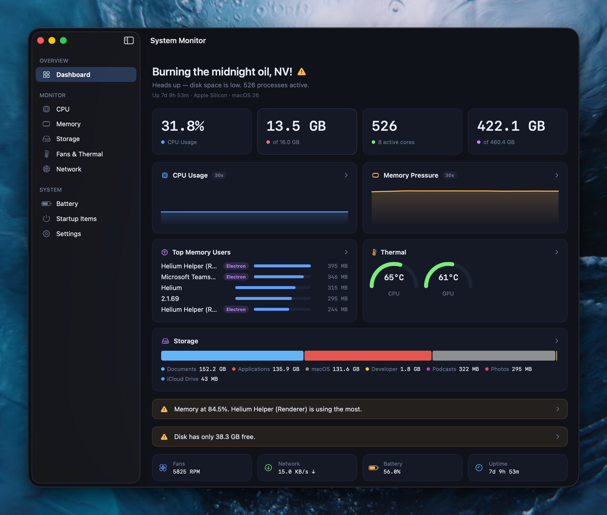

# System Monitor

A native macOS system monitor built with SwiftUI. Real-time hardware monitoring with zero third-party dependencies.


## Features

- **CPU** — Per-core usage with P-core/E-core detection, load averages, usage history
- **Memory** — App memory, wired, compressed, cached breakdown (matches Activity Monitor)
- **Storage** — Category breakdown mirroring macOS System Settings
- **Thermal** — Real-time temperature from SMC sensors (Apple Silicon + Intel)
- **Fans** — Live RPM readings with min/max gauges
- **Network** — Per-interface bandwidth monitoring
- **Battery** — Charge level, health, cycle count, power source
- **Processes** — Sorted by memory usage with Electron app grouping
- **Startup Items** — Login items and launch agents/daemons

## Screenshot



## Requirements

- macOS 15+ (macOS 26 Tahoe recommended for Liquid Glass)
- Xcode 16+ / Swift 6.0+
- Apple Silicon or Intel Mac

## Build

```bash
# Debug build
swift build

# Run
.build/debug/SystemMonitor

# Release .app bundle
./scripts/build-app.sh
```

The build script creates `System Monitor.app` in the project root, ready to drag into `/Applications`.

## Architecture

```
Sources/SystemMonitor/
├── App/           # @main entry point
├── Models/        # Data structs (Sendable, Identifiable)
├── Services/      # System data collection (IOKit, Mach, libproc)
├── Utilities/     # Theme, formatters, Electron detector
└── Views/
    ├── Components/  # Reusable UI (cards, gauges, sparklines)
    ├── Pages/       # Detail views for each section
    └── ...          # Dashboard, sidebar, content
```

### Data Sources

| Service | API | Refresh |
|---------|-----|---------|
| CPU | `host_processor_info()` | 2s |
| Memory | `host_statistics64()` | 2s |
| SMC (temp/fans) | IOKit `AppleSMC` | 2s |
| Processes | `proc_listallpids()` | 3s |
| Network | `getifaddrs()` AF_LINK | 1s |
| Battery | IOKit `AppleSmartBattery` | 10s |
| Storage | `URL.resourceValues` | 30s |

### Key Technical Details

- Direct SMC access via `IOConnectCallStructMethod` with little-endian key encoding for Apple Silicon
- Memory formula matches Activity Monitor: `used = appMemory + wired + compressed`
- Electron app detection by scanning for `Electron Framework.framework` in app bundles
- All services use dedicated `DispatchQueue` for thread safety with `@Observable`

## License

MIT
